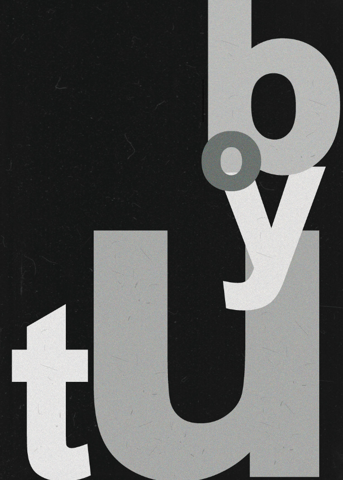
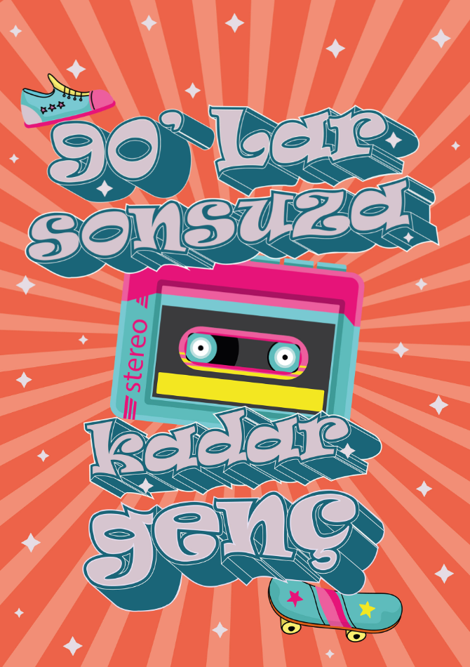

<html lang="tr">
<head>
    <meta charset="UTF-8">
    <meta http-equiv="X-UA-Compatible" content="IE=edge">
    <meta name="viewport" content="width=device-width, initial-scale=1.0">
    <title>Zeynep Çakıroğlu</title>
    <link rel="preconnect" href="https://fonts.googleapis.com">
<link rel="preconnect" href="https://fonts.gstatic.com" crossorigin>
<link href="https://fonts.googleapis.com/css2?family=Nunito+Sans:wght@200&display=swap" rel="stylesheet">
    
</head>
<body>
 
    <!-- sayfa üstü-->
    

        

            

                <h1>PORTFOLYO</h1>
                <h2>Zeynep Çakıroğlu</h2>
            

            

                <ul>
                    <li><a href="#">Hakkımda</a></li>
                    <li><a href="#">Tasarımlar</a></li>
                    <li><a href="#">Blog</a></li>
                    <li><a href="#">İletişim</a></li>
                </ul>
            

        

    

 
    <!-- sayfa ortası-->
    

        

            
        

        

            

                
                <h2>İllüstrasyon</h2>
                
Göz illüstrasyon çizimi

            

            

                
                <h2>Afiş Tasarımı</h2>
                
Boyut afiş tasarımı 

            

            

                
                <h2>Afiş Tasarımı</h2>
                
90'lar sonsuza kadar genç! afiş tasarımı 

            

 
 
        

        

        

            

                <h1>Zeynep Çakıroğlu</h1>
                
Merhaba, ben Zeynep. Fırat Üniversitesi Görsel İletişim Tasarımı Bölümü 4. sınıf öğrencisiyim. Lise eğitimimide Grafik Tasarım Bölümünde tamamladım. Grafik Tasarım alanında 8 yıldır eğitim almaktayım. 

            

            

                
            

        

    

 
    <!-- sayfa altı-->
    

        

            

                <ul>
                    <li><a href="#">Zeynep Çakıroğlu</a></li>
					 		 
&nbsp;  
&nbsp;
&nbsp;			 
					  
&nbsp;  
&nbsp;
&nbsp;
					 
&nbsp;  
&nbsp;
&nbsp;
					 
                </ul>
            

        

    

    
</body>
</html>
